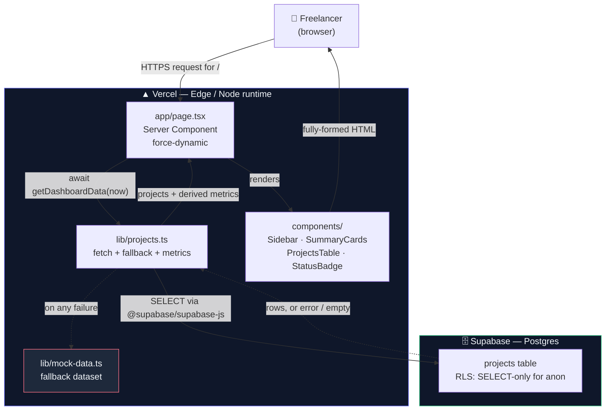
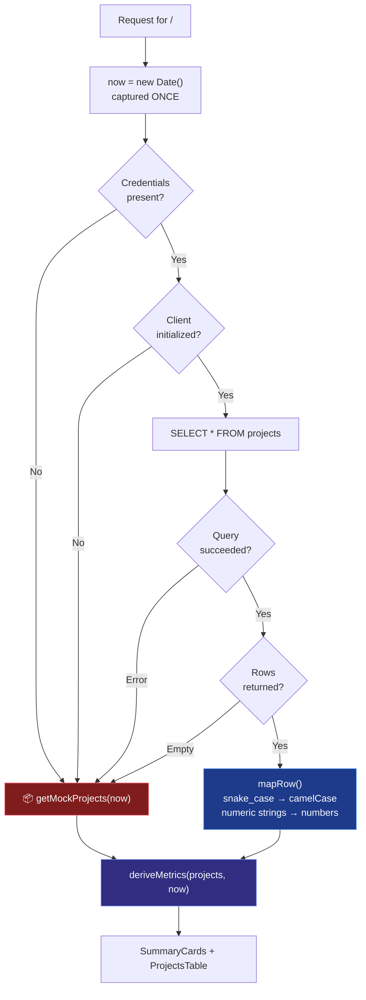
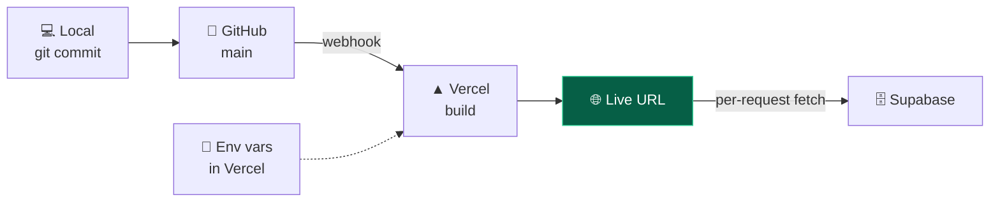

# 🏗 Architecture — ServicePro

Rubric item: *"Architecture sketch and stack table explain how the feature works."*

> The diagrams below are Mermaid and render automatically on GitHub. For the
> submission PDF, screenshot them from the GitHub view of this file.

---

## System components

**The key property:** the browser never talks to Supabase. Data is fetched
server-side during the render, so the user receives complete HTML — no loading
spinner, no request waterfall, and no database round trip from the client.

---

## Data flow, including every failure path

Four distinct failures converge on one fallback, so the page has exactly one
degraded state to reason about — and it looks identical to the healthy one.

---

## Tech stack

| Layer | Choice | Role | Why this, and what was rejected |
|---|---|---|---|
| Framework | **Next.js 16** (App Router) | Routing + server rendering | Server Components let the fetch happen before HTML is sent. *Rejected: client-side `useEffect` fetching* — it exposes the database call to the browser and forces a loading state. |
| UI | **React 19** | Component model | Bundled with Next 16. |
| Language | **TypeScript** | Type safety | The `ProjectStatus` union makes an invalid state unrepresentable at compile time rather than a runtime crash in the badge lookup. |
| Styling | **Tailwind CSS v4** | Design system | CSS-first: tokens live in `@theme`, so there is no config file to drift from the styles. *Rejected: a component library* — heavier than this UI needs and harder to match to the mockup. |
| Database | **Supabase** (Postgres) | Persistence | Free, hosted, no backend to write. Real `CHECK` constraints enforce data validity at the source. *Rejected: a JSON file* — no persistence story and no database evidence for the assignment. |
| Client | **@supabase/supabase-js** | Query layer | Official SDK; PostgREST under the hood. |
| Hosting | **Vercel** | Deployment | Zero-config for Next.js; auto-deploys every push to `main`, which also produces the deployment evidence. |
| Icons | **Inline SVG** | Iconography | *Rejected: an icon package* — a dependency and a network request for eight glyphs. Inline SVG inherits `currentColor`, so state changes are free. |
| Dates/money | **`Intl` built-ins** | Formatting | *Rejected: date-fns / moment* — the standard library covers this, with no bundle cost. |

**Dependency count: one.** Everything else is the framework or the platform.

---

## Data model

Single table. The relational split into `projects` + `time_entries` was
deliberately deferred — this sprint needs a *value per project*, not a
per-session time log, and one nullable column expresses both billing models.

### `projects`

| Column | Type | Notes |
|---|---|---|
| `id` | `uuid` PK | `gen_random_uuid()` |
| `name` | `text` NOT NULL | |
| `client` | `text` NOT NULL | |
| `status` | `text` NOT NULL | `CHECK` in the four UI states — a typo can't create a project the interface has no badge for |
| `deadline` | `date` NOT NULL | Calendar date, not a timestamp: a deadline is a day, not an instant |
| `hours_logged` | `numeric(6,2)` | |
| `hourly_rate` | `numeric(8,2)` | |
| `invoice_total` | `numeric(10,2)` NULL | Fixed fee. `NULL` ⇒ bills hourly |
| `is_paid` | `boolean` | |
| `paid_at` | `date` NULL | |
| `created_at` | `timestamptz` | |

**Constraint:** `is_paid` and `paid_at` must agree — a project cannot be paid
without a payment date. Without it, revenue could silently vanish from the
earnings metric.

**Security:** RLS enabled with exactly one `SELECT` policy for `anon`. Both
alternatives fail quietly: RLS disabled makes the table publicly *writable*;
RLS enabled with no policy returns an empty array, and the app falls back to
mock data while appearing to work perfectly.

### Derived values — never stored

| Value | Rule |
|---|---|
| Project value | `invoice_total ?? hours_logged × hourly_rate` |
| Unpaid Invoices | Σ value where not paid **and** status ∈ {`invoice_sent`, `overdue`} |
| This Month's Earnings | Σ value where paid **and** `paid_at` in the current month |
| Active Projects | count where status ≠ `invoice_sent` |

Computed rather than stored so the summary cards and the table are guaranteed to
agree — they read from the same array.

---

## Deployment pipeline

Environment variables are set in the Vercel dashboard, never committed.
`.env.example` documents the required names with no values.
