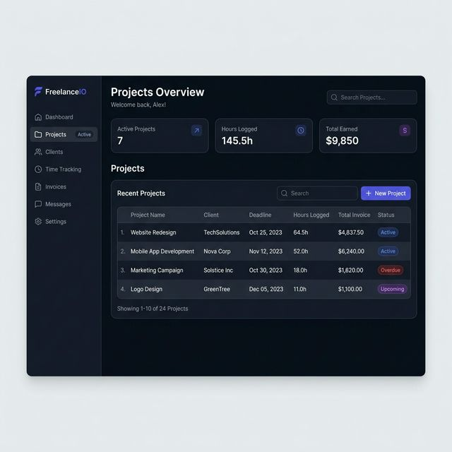

# 🖼 UX Implementation Note

Rubric item: *"Mockup or wireframe, **implementation note**, and scope cut are included."*

How the image-generated mockup became the shipped interface — what was kept,
what was deliberately changed, and why.

**Mockup:** [`images/ux-mockup.jpg`](images/ux-mockup.jpg) — AI-generated during
the UX planning stage, before any code existed.

> Note: the original file was named `.png` but contained JPEG data. That
> mismatch is why it failed to display in several tools; it is stored here with
> the correct extension.

---

## What the mockup got right, and was kept

| Element | Kept as designed |
|---|---|
| Dark slate canvas with a darker sidebar rail | Yes — became `--color-app` / `--color-surface` |
| Three summary stat cards above a table | Yes — the core information hierarchy |
| Indigo as the single accent colour | Yes — active nav and one metric icon only |
| Colour-coded status pills, right-most column | Yes — four variants |
| Left sidebar, brand mark top-left | Yes |
| Restrained depth — hairline borders, no heavy shadows | Yes — this is what makes it read as "premium" |
| Generous cell padding, small-caps column labels | Yes |

The mockup's core judgement — *money and deadlines are the two things a
freelancer opens this for, so both belong above the fold* — drove the whole
layout and was never revisited.

---

## Deliberate divergences

A mockup is a proposal, not a spec. Six changes were made, each for a reason
that only becomes visible once the design is real code.

### 1. Seven nav items → four
The mockup shows Dashboard, Projects, Clients, Time Tracking, Invoices,
Messages, Settings. The handoff document specifies four.

**Changed because** the scope cut builds exactly one route. Seven nav items
advertise seven features, six of which don't exist — the interface would be
writing cheques the app can't cash. Four is still enough to communicate the
product's shape.

### 2. "FreelanceIO" → "ServicePro"
The image generator invented a brand name. The product is ServicePro per the
Build Discipline Packet.

### 3. Nav links are inert, not clickable
**Changed because** the handoff simultaneously requires a sidebar (§2.1) and
forbids routing (§4). Three ways to resolve that:

| Option | Rejected because |
|---|---|
| `href="#"` links | Clicking does nothing and jumps the scroll — reads as broken |
| Full-brightness, no handler | Looks live, silently dead. The worst option for a grader clicking around |
| **Inert, dimmed, `aria-disabled`** ✅ | Honest. Communicates "not this sprint" without pretending |

### 4. "Oct 25, 2023" → deadlines relative to today
The mockup hardcoded dates in the past.

**Changed because** a dashboard whose every row reads years overdue is worse
than no dashboard. Deadlines are now computed from the current date, so the
interface is correct whenever it's opened — including at grading time, whenever
that happens.

This forced the more useful feature underneath: the column shows both the date
*and* the distance to it (`Oct 25 · in 3 days`), with colour escalating from
grey → amber within three days → rose when overdue. The mockup's flat date
string couldn't convey urgency; that was the point of the column.

### 5. Hours and Total Invoice merged into one Value column
The mockup had separate columns for Hours Logged and Total Invoice.

**Changed because** not every project bills hourly. A fixed-fee project has a
meaningful total and a meaningless hourly figure, so the hours column would sit
half-empty. One **Value** column shows the money, with `64.5h × $75` as
secondary text *only* when the project actually bills hourly. Fixed-fee rows
simply omit it. This also freed the horizontal space that mobile needed.

### 6. "Showing 1–10 of 24 Projects" removed
**Changed because** pagination isn't built, and a control implying 24 records
when six exist is a false claim about the product. Replaced with an honest live
count.

---

## Added, not in the mockup

**A mobile layout.** The mockup is a single desktop artboard. A four-column
table at 375px either scrolls sideways or crushes — both read as unfinished, and
mobile rendering is explicitly graded. Below `640px` each project becomes a
stacked card: name and client, status pill, then value and deadline on one row.
The sidebar collapses to a 64px icon rail rather than disappearing, so the
product's structure stays legible.

**Accessibility the mockup couldn't express.** Status badges always carry a text
label, so colour is never the sole signal — they stay readable for colour-blind
users and in a greyscale printout of the submission PDF. The table uses a
`<caption>`, `scope` on headers, and row headers.

---

## Scope cut — what was designed but not built

| Cut | Why |
|---|---|
| Authentication | Single-user context is enough to demonstrate the value; auth is a week of work that shows nothing new |
| PDF invoice export | The *calculation* is the insight; PDF generation is plumbing |
| Stripe / payments | A payment gateway is a product, not a feature |
| Create/edit forms | Reading the data proves the concept; writing it doubles the surface area |
| Time-entry logging | `hours_logged` as a field captures the value; per-session logging is a v2 table |
| Messages, Clients, Invoices pages | Would require the routing the scope explicitly excludes |
| Light mode | Dark-only is the aesthetic decision, not a missing feature |

Everything cut is cut on purpose. Nothing in the interface hints at these
features, so nothing looks broken by their absence.
