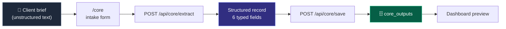
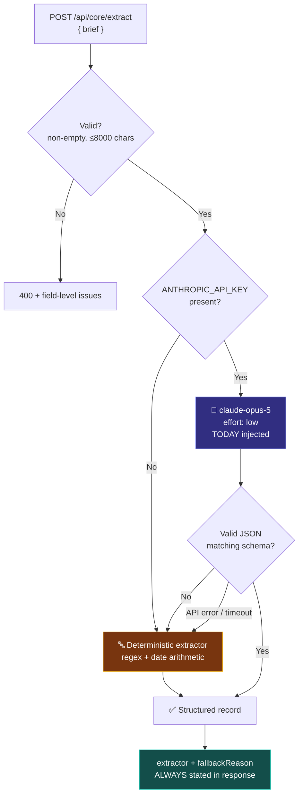

# 🏗 Week 1 Architecture — Generative Core

Required evidence: *"Architecture sketch and stack table explain how the feature works."*

> Mermaid diagrams render natively on GitHub — screenshot them from the GitHub
> view of this file for the submission PDF.

---

## What the module does

Converts an unstructured client brief — an email, a Slack message, a note — into
a validated, structured project record, and persists it.



---

## Extraction path, including fallback



**The response always names which path produced it.** This is a direct
consequence of Week 0, where production served mock data across six deployments
because the fallback was designed to be invisible. Resilience that conceals its
own degradation is a liability, so here the degraded path announces itself — in
the API response, in the UI badge, and in the saved database row.

---

## Why a model at all

The deterministic extractor is genuinely capable: it parses rates, hours, and
absolute dates, and resolves bare month-day forms forward rather than into the
past. It is not a stub.

It fails on exactly the things language does casually:

| Brief says | Regex | Model |
|---|---|---|
| "by the end of next month" | `null` | `2026-09-30` |
| "— Dana, Northwind Co" | `null` | `Northwind Co` |
| "following up on the redesign" | `Up On The Redesign` | `Website Redesign` |

The model earns its place on relative dates and on inferring intent from prose.
Everything it does that regex already handles is redundant — which is why regex
remains the fallback rather than being deleted.

---

## Data model — `core_outputs`

| Column | Type | Notes |
|---|---|---|
| `id` | `uuid` PK | |
| `raw_input` | `text` | The original brief, kept so an extraction can be audited against its source |
| `project_name` | `text` | |
| `client` | `text` NULL | Null when the brief never names one |
| `hourly_rate` | `numeric` NULL | |
| `hours_logged` | `numeric` NULL | |
| `deadline` | `date` NULL | |
| `status` | `text` | CHECK-constrained to the four project states |
| `confidence_note` | `text` | What the model inferred vs. what was stated |
| `extractor` | `text` | `model` or `heuristic` — persisted, not just displayed |
| `prompt_version` | `text` | `v1.0.0` — ties a row to the prompt that produced it |
| `created_at` | `timestamptz` | |

**Nullable by design.** A brief that omits a rate must produce `null`, never a
guess. The single worst outcome for this module is a confident, wrong record,
so the schema makes absence representable and the prompt requires it.

**`extractor` and `prompt_version` are stored on every row.** When a future
prompt revision changes extraction quality, existing rows can be attributed to
the version that produced them. Without this, the table becomes an
undifferentiated mix of outputs from prompts that no longer exist.

---

## Stack additions this week

| Layer | Choice | Why, and what was rejected |
|---|---|---|
| Model | `claude-opus-5`, effort `low` | The task is well-specified with a fixed schema, so deep reasoning buys little. *Rejected: higher effort* — measured ~7s already; more would hurt a form a user waits on. |
| SDK | `@anthropic-ai/sdk` | Official client. |
| Validation | `zod` | One schema validates the model's JSON, the API request, and the save payload. *Rejected: hand-written type guards* — three places to drift. |
| Prompt storage | Versioned constant in `lib/core/prompt.ts` | Version string is persisted with each row. *Rejected: inline string in the route* — unversionable and untestable. |
| Fallback | Deterministic regex extractor | *Rejected: returning an error when the key is missing* — the page must work for a grader with no credentials, and Week 0 proved the deployment can lack env vars without anyone noticing. |

**Key handling:** `ANTHROPIC_API_KEY` has **no** `NEXT_PUBLIC_` prefix and is
read only by `lib/core/extract.ts`, which is imported solely by a Route Handler.
It never enters client JavaScript. A `NEXT_PUBLIC_` prefix here would ship a
billable API key to every visitor.

---

## Request lifecycle

```mermaid
sequenceDiagram
    participant U as Browser
    participant R as Route Handler (server)
    participant C as Claude API
    participant S as Supabase

    U->>R: POST /api/core/extract { brief }
    R->>R: validate (non-empty, ≤8000)
    R->>C: prompt + brief + TODAY
    C-->>R: JSON
    R->>R: zod parse; on failure → heuristic
    R-->>U: { fields, extractor, fallbackReason? }
    U->>U: render output card + extractor badge
    U->>R: POST /api/core/save { raw_input, extractor, fields }
    R->>S: INSERT core_outputs
    S-->>R: id
    R-->>U: 201 { id }
```

The browser never holds the API key and never contacts Claude or Supabase
directly. Both are server-side only.
