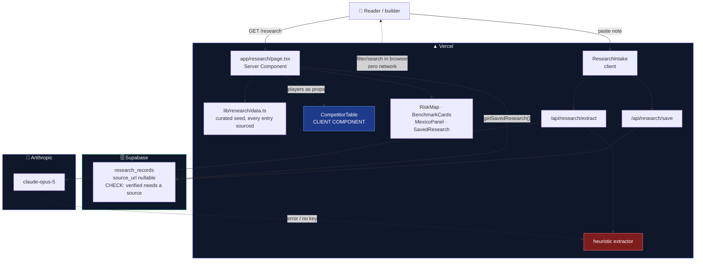
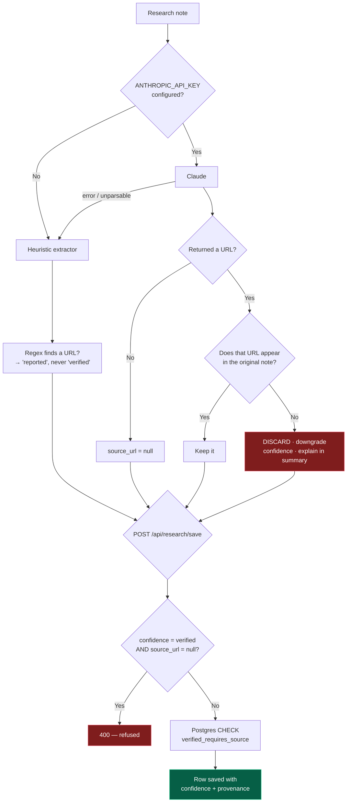

# 🏗 Week 2 Architecture — Research module

> Mermaid renders natively on GitHub. Screenshot from the GitHub view for the submission PDF.

---

## System components



**The architectural first:** `CompetitorTable` is the project's first Client Component. Weeks 0
and 1 were entirely server-rendered. Filtering must feel instant, and a network round trip per
keystroke for eleven rows would be absurd, so the dataset is passed from the server once and
narrowed in the browser. The page itself stays a Server Component — only the table is a client
island.

---

## The anti-fabrication pipeline

Every path a claim can take to the screen, and where it is checked:



**Four independent checks**, because a single one would be a single point of failure:

1. **The prompt** forbids inventing a URL.
2. **The code** (`rejectUnsupportedSource`) discards any URL not present in the source note —
   because instruction is not enforcement.
3. **The API route** refuses `verified` with no source, returning an actionable message.
4. **The database** enforces the same rule with a `CHECK` constraint, so it holds regardless of
   which client writes.

---

## Data model — `research_records`

| Column | Type | Notes |
|---|---|---|
| `id` | uuid PK | |
| `raw_input` | text | Original note, kept for audit |
| `title` · `summary` | text | |
| `category` | text | CHECK: competitor, substitute, benchmark, risk, insight |
| `region` | text | CHECK: global, mexico |
| `source_url` | text **nullable** | NULL is a legitimate state |
| `verified_on` | date nullable | |
| `confidence` | text NOT NULL | CHECK: verified, reported, estimated |
| `extractor` · `prompt_version` | text | Provenance, as in `core_outputs` |
| `created_at` | timestamptz | |

**The one honesty rule enforced in the database:**

```sql
constraint verified_requires_source
  check (confidence <> 'verified' or source_url is not null)
```

`source_url` stays nullable on purpose. `NOT NULL` would be worse: it would push people to paste a
plausible link to satisfy the constraint, which is fabrication with extra steps. The schema
surfaces the weakness rather than forbidding it.

---

## Tech stack — Week 2 additions

| Layer | Choice | Why, and what was rejected |
|---|---|---|
| Research verification | WebSearch + WebFetch against primary sources | *Rejected: model memory* — the training cutoff predates the assignment, so every figure would be stale and confident |
| Filtering | Client Component + `useMemo` | *Rejected: server-side filtering* — a round trip per keystroke for 11 rows |
| Risk map | CSS grid + inline SVG | *Rejected: Recharts / Chart.js* — a dependency for one 3×3 grid |
| Extraction | Reuses Week 1's extractor + fallback | The module compounds rather than sitting beside the last one |

**Net new third-party dependencies: zero**, for the third week running.
